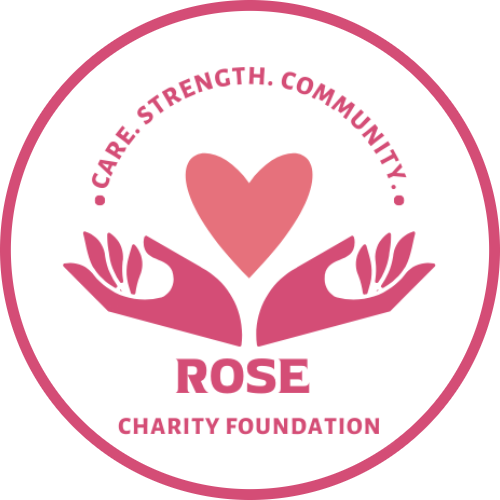

# KV6002 - ROSE Foundation

Live site available at:

https://k6002-2b4cf.web.app/

## Table of Contents

- [About](#about)
- [Features](#features)
- [Installation](#installation)
- [Usage](#usage)
- [Technologies Used](#technologies-used)
- [Acknowledgements](#acknowledgements)

---

## About

University project for KV6002. This project aims to provide the ROSE Doundations a system for charity staff to advertise and manage events. Customers can sign up to events they wish to attend, and are provided with a confirmation SMS, cancellation system, and reminder text 24 hours before the event takes place.

## Features

- ✅ Sign up for events
- ✅ Add, update and delete new charity events (staff only)
- ✅ Leave feedback to the charity

- **Responsive Design**: Adapts to any screen size.
- **Event Booking**: Users can RSVP for events in real time.
- **Reminders**: Automated SMS reminders for upcoming events.
- **Easy cancellations**: Simply send us a text if you can no longer attend.
- **Attendance management**: See the number of attendees and manage customer details from one panel.

---

## Installation

### Prerequisites

- **Node.js**
- **npm**

### Local Build Steps

1. Clone the repository
2. Navigate to the 'KV6002' folder
   ('cd KV6002')
3. Install dependancies
   ('npm install')
4. Run developer build
   ('npm run dev')

For login information, see 'logins.txt' provided with the project files

### Technologies Used

- React.js
- MaterialUI
- Firebase / Firestore, Firebase Functions
- Vonage SMS API

### Acknowledgements

Cameron Hall (development), Steven Kilty (development), Moise Muamba(development), George Bunton (project management), Josh Dawson (design), Muska Amarkhil (design)
